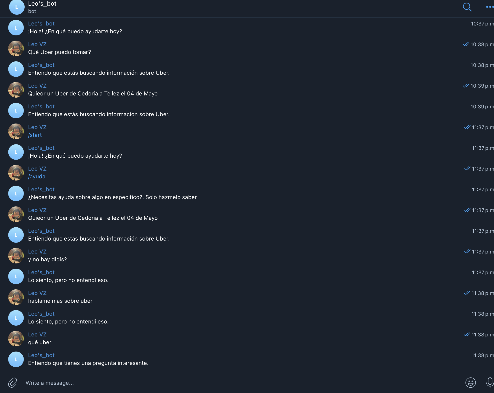

# Telegram Bot para Consultas de Uber

Este proyecto es un bot de Telegram que te permite realizar consultas sobre Uber de una ciudad a otra en una fecha específica.

# Expresión regular para detectar preguntas y consultas de Uber:

\b(qué|cuándo|dónde|por qué|cómo)\b|\bUber de (\w+) a (\w+) el (\d{1,2}) de (\w+)

- `\b(qué|cuándo|dónde|por qué|cómo)\b`: Este grupo coincide con palabras como "qué", "cuándo", "dónde", "por qué" y "cómo". El \b representa un límite de palabra para asegurarse de que la palabra esté completa.
- `|`: Es el operador de alternancia, que permite buscar cualquiera de los dos patrones que están a ambos lados del operador.
- `\bUber de`: Esto busca la palabra "Uber" seguida de la palabra "de".
- `(\w+)`: Este grupo coincide con una o más letras, dígitos o guiones bajos, representando el origen del viaje en Uber.
- `a`: Coincide con la letra "a", que separa el origen y el destino del viaje en Uber.
- `(\w+)`: Otro grupo que coincide con una o más letras, dígitos o guiones bajos, representando el destino del viaje en Uber.
- `el`: Coincide con la palabra "el", que introduce la fecha del viaje en Uber.
- `(\d{1,2})`: Este grupo coincide con uno o dos dígitos, representando el día del mes en el que se realizará el viaje en Uber.
- `de`: Coincide con la palabra "de", que separa el día del mes y el mes en palabras.
- `(\w+)`: Otro grupo que coincide con una o más letras, representando el mes en palabras en el que se realizará el viaje en Uber.





## Funcionalidades

- Saludo inicial al iniciar el bot con el comando `/start`.
- Proporcionar ayuda con el comando `/ayuda`.
- Responder a consultas y preguntas sobre Uber.

## Uso

1. Inicia el bot con el comando `/start`.
2. Utiliza el comando `/ayuda` para obtener información sobre cómo interactuar con el bot.
3. Realiza consultas sobre Uber utilizando el formato "Uber de CiudadOrigen a CiudadDestino el DD de Mes".

Ejemplo de consulta: "Uber de México a Japón el 25 de marzo".


## Ejecución

1. Clona este repositorio en tu máquina local.
2. Instala las dependencias necesarias (Telegram API).
3. Ejecuta el script Python `main.py` para iniciar el bot.

## Dependencias

Este proyecto utiliza la librería `python-telegram-bot` para interactuar con la API de Telegram. Asegúrate de instalar esta dependencia antes de ejecutar el bot.

## Código

```python
import logging
import re

from telegram import Update
from telegram.ext import Application, CommandHandler, ContextTypes, MessageHandler, filters

Habilitar registros

logging.basicConfig(format="%(asctime)s - %(name)s - %(levelname)s - %(message)s", level=logging.INFO)
logging.getLogger("httpx").setLevel(logging.WARNING)
logger = logging.getLogger(__name__)

Expresión regular para detectar preguntas y consultas de Uber

expresion_consulta = re.compile(r"\b(qué|cuándo|dónde|por qué|cómo)\b|\bUber de (\w+) a (\w+) el (\d{1,2}) de (\w+)", re.IGNORECASE)

async def iniciar(update: Update, context: ContextTypes.DEFAULT_TYPE) -> None:
"""/start: Saludo inicial."""
usuario = update.effective_user
await update.message.reply_html(
rf"¡Hola! ¿En qué puedo ayudarte hoy?"
)

async def ayuda(update: Update, context: ContextTypes.DEFAULT_TYPE) -> None:
"""/ayuda: Proporciona información de ayuda."""
await update.message.reply_text(
"¿Necesitas ayuda sobre algo en especifico?. Solo hazmelo saber"
)

async def responder_mensaje(update: Update, context: ContextTypes.DEFAULT_TYPE) -> None:
"""Responder a los mensajes del usuario basándose en los patrones detectados."""
if update.message and update.message.text:
mensaje = update.message.text
if expresion_consulta.search(mensaje):
await manejar_consulta(update)
else:
await update.message.reply_text("Lo siento, pero no entendí eso.")
else:
logger.warning("Mensaje inválido recibido: %s", update.message)

async def manejar_consulta(update: Update) -> None:
"""Responder a las consultas detectadas."""
mensaje = update.message.text
if "Uber" in mensaje:
await update.message.reply_text("Entiendo que estás buscando información sobre Uber.")
else:
await update.message.reply_text("Entiendo que tienes una pregunta interesante.")

def main() -> None:
"""Iniciar el bot y definir los manejadores de comandos y mensajes."""
application = Application.builder().token("7165798113:AAG9OwYYc3wwr6hOPv7ybus9pzBLSpHrDxI").build() 

# Agregar manejadores de comandos y mensajes
application.add_handler(CommandHandler("start", iniciar))
application.add_handler(CommandHandler("ayuda", ayuda))
application.add_handler(MessageHandler(filters.TEXT & ~filters.COMMAND, responder_mensaje))

# Iniciar el bot y escuchar los mensajes entrantes
application.run_polling(allowed_updates=Update.ALL_TYPES)
if __name__ == "__main__":
main()
```
