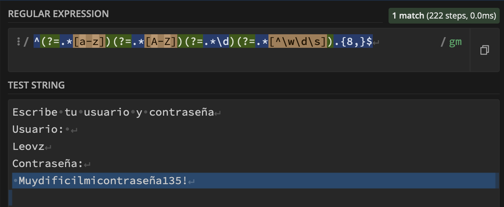

## Expresiones Regulares

### Expresión Regular para validar un Password Fuerte

Un password fuerte debe contener al menos:
- 1 minúscula
- 1 mayúscula
- 1 número
- 1 carácter especial
- Longitud mínima de 8 caracteres

**Expresión Regular:**
```regex
^(?=.*[a-z])(?=.*[A-Z])(?=.*\d)(?=.*[^\w\d\s]).{8,}$
```




## Expresión Regular para validar un Nombre de Usuario

Un nombre de usuario válido debe tener:

- Longitud de 3 a 16 caracteres
- Puede contener letras, números, guiones medios y guiones bajos

**Expresión Regular:**

```regex
^[a-zA-Z0-9_-]{3,16}$
```


